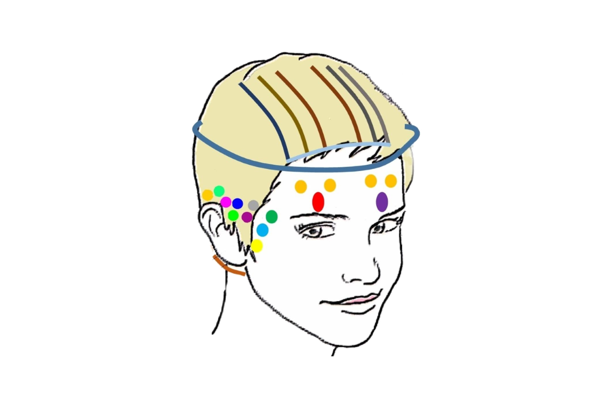

Access Bars to nie masaż, a zabieg energetyczny. Docelowo służy temu, byśmy otworzyli się na przyjmowanie. A nasze wyobrażenia o sobie i świecie tę umiejętność ograniczają.

„Bars” znaczy tyle co pręty. – Można je sobie wyobrazić jako rodzaj siatki energetycznej w głowie. Pod wpływem dotyku wytwarza się różnica potencjałów dwóch ciał i dochodzi do czegoś w rodzaju przepięcia. Oczywiście, nie da się tego zobaczyć, zmierzyć i nie zamierzam przekonywać, że pozytywne zmiany po zabiegu to zasługa tej metody. Po prostu nie wiem tego i nie potrafię sprawdzić. Znów – wszystko zależy od tego, w co chcemy wierzyć. Najlepiej poczuć to na własnym organizmie – jeśli jesteś w stanie otworzyć się, poddać temu, przychodzi lekkość i błogostan.

Poza zabiegiem, polegającym na dotykaniu 32 punktów, i pytaniami, częścią metody jest też stwierdzenie: „interesujący punkt widzenia”. Warto powtarzać je jak najczęściej – to pomoże ci przestać oceniać. Zrozumieć, że nie ma prawd ostatecznych… Wszędzie tam, gdzie myślisz, że masz rację, możesz to zakwestionować! Bo to tylko punkt widzenia i do tej samej sytuacji można zastosować wiele innych punktów widzenia, perspektyw. A wszystkie mogą być interesujące…
‌Cena 150 Zł
