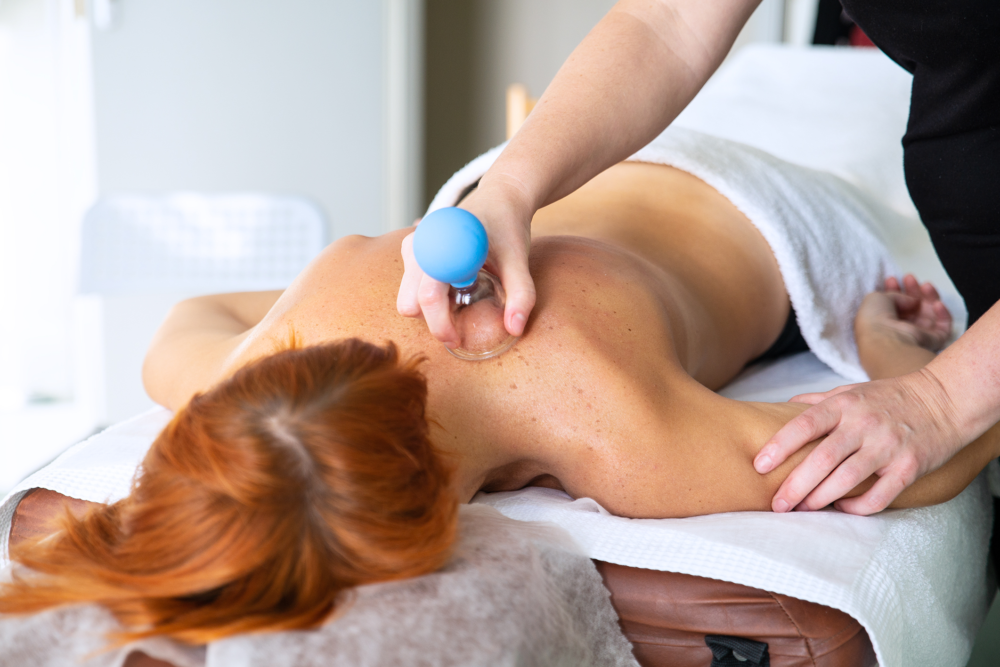

## Masaż bańką wschodnią

Bańka jest dobra nie tylko na brzuch i cellulit. Stosuje się ją również w celu likwidacji bólów kręgosłupa czy dolegliwości mięśniowych. Bańka ma wiele wspólnego z bańkami akupunkturowymi (leczniczymi), które stosuje się w medycynie ludowej w przypadku leczenia wielu dolegliwości. Bańki zmniejszają napięcie mięśniowe, które powoduje np. bóle kręgosłupa, a także uciskanie splotów nerwowych i stopniowe powstawanie dolegliwości całego ciała.

### Wskazania:

-   Bóle kręgosłupa
-   Dolegliwości mięśniowe
-   Problemy ze stawami
-   Bóle różnego pochodzenia (w tym migrenowe i nerwobóle)
-   Dolegliwości płucne
-   Problemy z ukrwieniem

### Przeciwwskazania:

-   Gorączka nieznanego pochodzenia
-   Choroby nowotworowe i zakaźne
-   Padaczka, zespół odstawienia alkoholu czy narkotyków
-   SR(Stwardnienie rozsiane) w okresie nowego rzutu choroby
-   Przerwanie ciągłości i stany zapalne skóry(włączając w to siniaki i obrzęki niewiadomego pochodzenia)
-   Hemofilia
-   Cera naczyniowa
-   Niewydolność krążenia(np. zapalenie żył i żylaki), a także nadciśnienie tętnicze
-   Wady i choroby serca
-   Miesiączka
-   Ciąża
