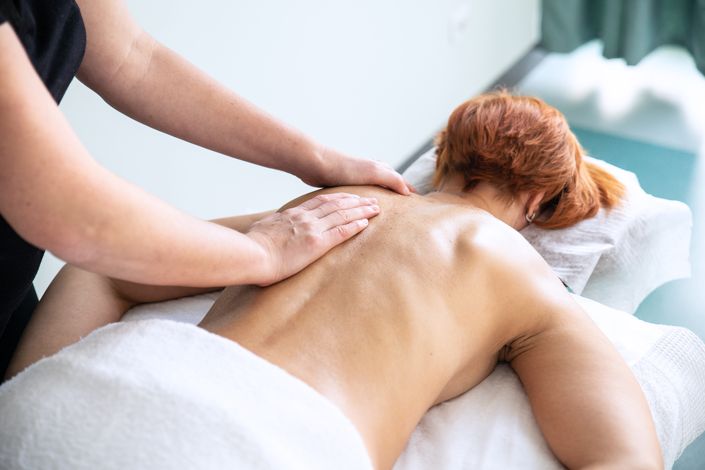

# Masaż klasyczny

Masaż klasyczny pobudza krążenie, rozluźnia, łagodzi bóle. Stosuje się także przy nerwicach, stanach lękowych i depresji. Pozytywnie oddziałuje na psychikę i stan fizyczny osób przemęczonych.

## Wskazania

- Bóle pleców
- Bóle karku
- Bóle mięśni
- Napięcie bólowe głowy
- Niewydolność krążenia
- Obrzęki
- Przykurcze
- Choroby reumatyczne

## Przeciwwskazania

- Ciąża
- Gorączka
- Żylaki
- Ropne zmiany skórne
- Krwiaki

## Uwaga

Nawet po odpowiednio dobranym do stanu zdrowia i profesjonalnym masażu należy przygotować się, że ból może się zwiększyć. Dopiero po kilku takich zabiegach czuje się zdecydowaną poprawę. Trzeba jednak zawsze wsłuchiwać się w swoje ciało - jeśli nastąpiło gwałtowne pogorszenie, należy poinformować o tym masażystę.
