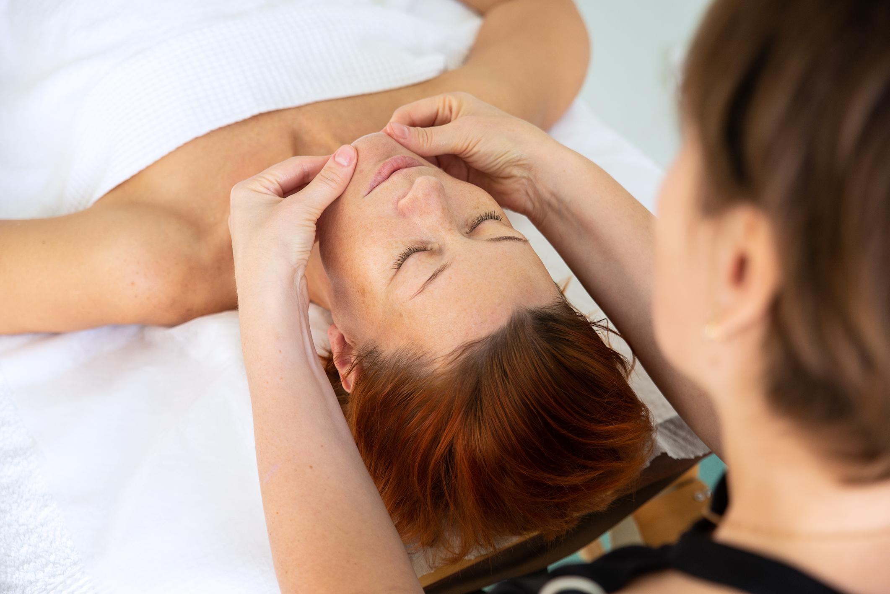

## Masaż twarzy

Wycisza emocje, łagodzi napięcia i stresy. Obniża poziom lęku, pomaga w problemach nerwowych i depresji. Przyśpiesza regenerację zmęczonego organizmu, dodaje energii i chęci do życia. Pomaga przy kłopotach ze snem. Efektem serii zabiegów może być głęboki relaks, uczucie dystansu i wewnętrznego spokoju, większa łatwość w rozwiązywaniu problemów.

### Wskazania

-   Stany po zapaleniu nerwów twarzy
-   Neuralgie twarzy
-   Bóle głowy pochodzenia naczynioruchowego
-   Stany po urazach głowy
-   Zespół kręgów szyjnych
-   Stan po szczękościsku

### Przeciwwskazania

-   Stan zapalny skóry głowy i twarzy
