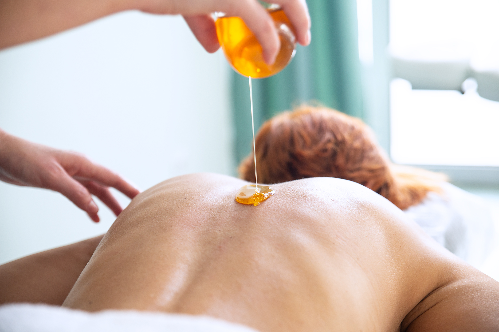

# Masaż miodem

Masaż miodem (zwany klepanym lub rosyjskim) to znana od dawna terapia stosowana w Ameryce Północnej, na Ukrainie, w Rosji i Japonii. W trakcie masażu miodem uruchamiany jest proces regeneracji skóry i tkanek podskórnych w tym mięśni, a także dochodzi do oczyszczenia skóry poprzez wydalenie nagromadzonych toksyn i zbędnych minerałów przez skórę. Masaż miodowy w kolejnym etapie trwania łączy się z masażem klasycznym w celu skutecznej i szybszej poprawy zdrowia.

## Działanie

Masaż ciepłym miodem wspomaga wydzielanie gruczołów potowych, ułatwiając usuwanie przez skórę szkodliwych substancji. Wyciąga nagromadzone w niej toksyny, otwiera pory, intensywnie dotlenia. Jest o wiele skuteczniejszy niż peeling i sauna. To oryginalna metoda terapii manualnej. Połączenie masażu leczniczego z działaniem miodu, przyczynia się do udrożnienia systemu limfatycznego oraz stymuluje wydzielanie gruczołów potowych. Masaż poprawia sprawność układu krążenia, działa przeciwzapalnie i wspomaga naturalną odporność organizmu (hartuje).

Korzystnie oddziałuje przy:

- depresji;
- spadku nastroju (chandrze);
- kuracji antynikotynowej;
- zmniejsza nadpobudliwość nerwową;
- regeneruje po przemęczeniu i wyczerpaniu;
- stabilizuje sen;
- działa regenerująco i odżywczo na skórę oraz skutecznie zapobiega powstawaniu cellulitu, rozstępów skóry i blizn.

## Przeciwwskazania

- nietolerancja miodu (uczulenie na produkty pszczele);
- choroba nowotworowa;
- zaawansowane żylaki i kruchość naczyń;
- choroba miażdżycowa;
- gorączka i stan podgorączkowy;
- ciąża.

## Uwaga

Masaż miodem wykonywany jest na gładkiej powierzchni skóry. Osoby z owłosieniem, np. na plecach przed masażem miodem powinny poddać się zabiegowi depilacji woskiem (na 3-4 dni przed masażem).
