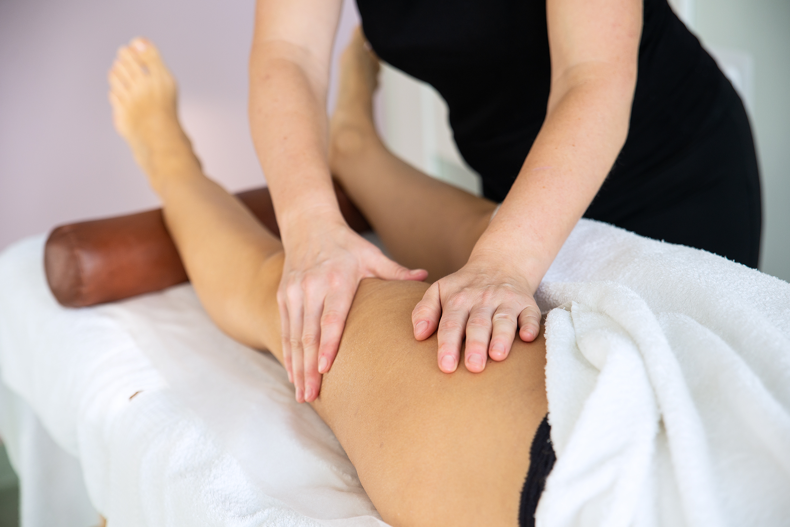

# Masaż limfatyczny

Masaż, w którym poprzez zastosowanie odpowiednich technik umożliwia się usprawnienie krążenia limfy i płynów tkankowych.Tempo masażu jest bardzo wolne (ok. 10-15 ruchów na minutę), a wykorzystywane techniki wykonywane są płynnie i delikatnie. Jest leczeniem wspomagającym przy mastektomii, obrzęku limfatycznym.

## Wskazania

-   Obrzęki zastoinowe kończyn i tułowia pierwotne i wtórne
-   Obrzęki kończyn górnych i dolnych w przebiegu leczenia chorób nowotworowych
-   Wysięki i obrzęki pourazowe
-   Poprawa funkcjonowania układu odpornościowego
-   Obrzęki kończyn dolnych powstałe na skutek np. długiej podróży
-   Uczucie ciężkości nóg z widoczną opuchlizną (np. u osób pracujących w pozycji stojącej)
-   Wspomaganie odchudzania

## Przeciwwskazania

-   Choroby skóry
-   Proces zapalny lub zakażenie toczące się w organizmie
-   Zakrzepica żył głębokich
-   Problemy z układem krwionośnym i sercem
-   Czynna choroba nowotworowa układu limfatycznego
-   Podwyższona temperatura skóry
