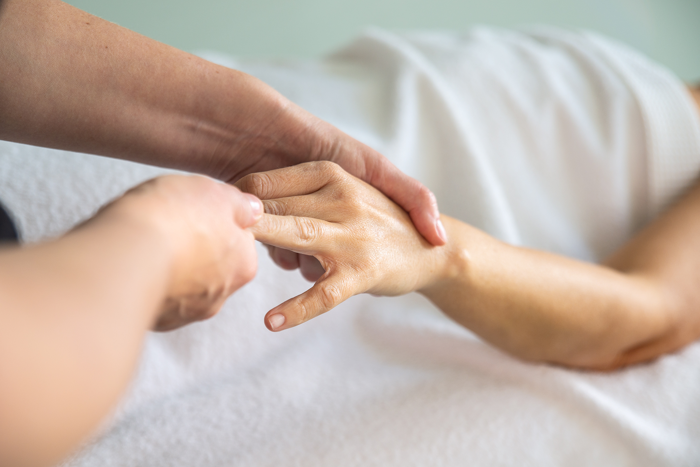

## Manualny

Masaż leczniczy wykorzystujący elementy technik terapii manualnej to najlepszy wybór dla pacjentów mających problem z przewlekłym bólem kręgosłupa, szyji lub stawów obwodowych. Dzięki masażowi leczniczemu uzyskujemy pozytywnie wpływające na organizm rozluźnienie tkanek, po czym dzięki technikom manualnym jesteśmy w stanie pobudzić poszczególne stawy kręgosłupa czy stawy obwodowe do prawidłowej pracy oraz zwiększyć ruchomość w miejscach, gdzie jest ona zaburzona ze względu na wcześniejszy uraz lub przeciążenie.

### Wskazania

-   Zaburzenia czynności ruchu w stawach, mięśniach, powięzi ścięgien
-   Postawne
-   Ruchowe
-   Oddechowe
-   Ostre i przewlekłe zespoły bólowe kręgosłupa i kończyn
-   Bóle i zawroty głowy z udziałem czynnika okręgowego

### Przeciwwskazania

-   Złamania
-   Ostre stany zapalneg
-   Zmiany nowotworowe układu kostnego
-   Ciążka
-   Osteoporoza
-   Niewydolność krążenia mózgowego
-   Poważne zaburzenia internistyczne
-   Stan po operacji kręgosłupa
