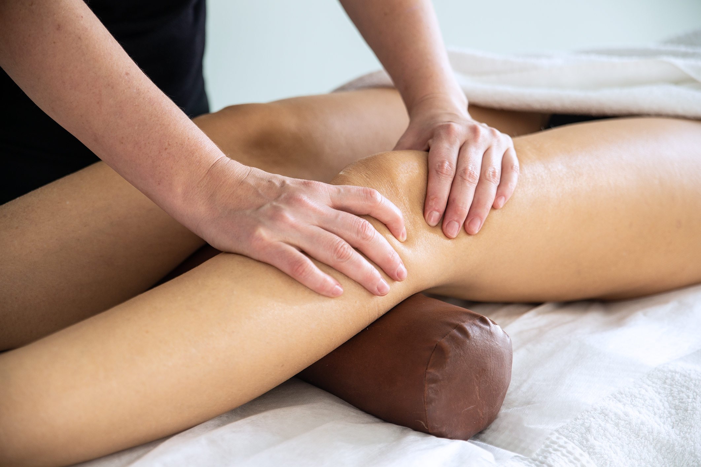

## Masaż sportowy

Masaż sportowy różni się od klasycznego wkładem siły i energii, oraz przewagą technik rozcierania i ugniatania. Można stosować go na określone partie ciała (masaż częściowy) lub całościowo (masaż ogólny). Działanie masażu sportowego jest niezwykle różnorodne, jednakże głównie przypisuje mu się właściwości regenerujące. Dlatego też nazywa się go elementem sportowej odnowy biologicznej.

### Przeciwwskazania

-   Wysoka temperatura ciała (powyżej 48°C)
-   Stany zapalne(ostre i podostre) stawów i ścięgien
-   Wczesny okres po złamaniach, skeceniach, zwichnięciach (według wskazań ortopedy)
-   Pourazowe wylewy w stawach i mięśniach(do 3 dni po urazie)
-   Zapalenia żył
-   Zmiany dermatologiczne
