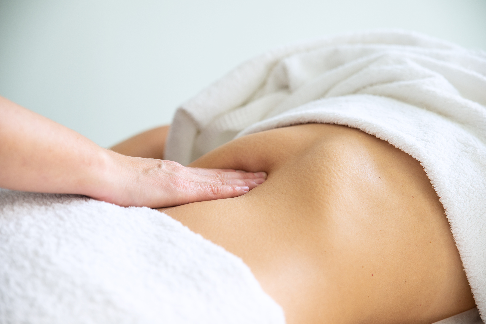

# Starosłowiański masaż brzucha

Jest metodą terapii narządów jamy brzusznej wywodzącą się z tradycji Medycyny Słowiańskiej. Zlikwidowanie zastojów żylno-limfatycznych w narządach i przestrzeniach wokół nich, wyeliminowanie przemieszczeń narządów wewnętrznych, prowadzi do normalizacji czynności fizjologicznych i regeneracji całego organizmu, bez konieczności stosowania silnych preparatów leczniczych. Dla chorego, jest to jeden ze sposobów na rozwiązanie problemów zdrowotnych, a dla zdrowego - utrzymanie zdrowia i zapobieganie chorobom.W czasie choroby narządów, pojawia się reakcja na dotknięcie albo naciśnięcie w poszczególnych okolicach ciała, oraz odczuć bólowych lub zwiększonej wrażliwości tych stref. Lokalizacja podrażnienia, jak również zdolność rozróżnienia ich odmiennych cech, zależy od specyficznych związków między narządem zmysłów i mózgiem. Znaczenie mózgu w powstawaniu odczuć, wyraźnie jest widoczne w zjawisku "odzwierciedlenia bólu."

## Wskazania

- Zapalenia pęcherzyka żółciowego
- Zapalenie trzustki
- Stany zastoinowe wątroby
- Zapalenie oskrzeli
- Choroba wrzodowa żołądka i dwunastnicy
- Zapalenie jelit
- Przewlekłe zaparcia
- Stany zastoinowe nerek
- Stany zastoinowe w miednicy małej
- Zaburzenia płuc i serca
- Choroby tarczycy
- Wydalenie kamienie pęcherzyka żółciowego

## Przeciwwskazania

- Perforacja wrzodu żółądka
- Stan narkotyczny i nietrzeźwości
- Nowotwory
- Stan ostrego brzucha
- Obecność krwawienia wewnętrznego
- Choroby przenoszone drogą płciową
- Mielopatia
- Otwarta gruźlica
- Postępujące chorby mózgu i jego obrzęk
- Zakrzepica naczyń
- Choroby psychiczne
- Kolagenozy
- Ostre choroby zakaźne z wysoką gorączką
- Choroby układu sercowo-naczyniowego w ostrej fazie

Źródło: A.T Ogułow
