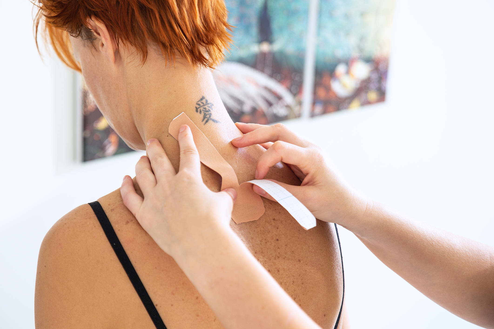

## Taping

Taping zmniejsza stany zapalne, działa przeciwbólowo, przeciwobrzękowo, przeciwwysiękowo oraz poprawia krążenie krwi i limfy. Kinesiology taping to technika poprawiająca stabilność stawów i mięśni bez negatywnego wpływu na krążenie i zakres ruchu, ma bardzo szerokie spektrum aplikacji. Przy tym taping pozwala na równoległą rehabilitację i utrzymywanie terapeutycznych korzyści 24 godziny na dobę.

### Wskazania

-   Bóle kręgosłupa różnego pochodzenia
-   Bóle kolan
-   Bóleg barku
-   Dolegliwości ze strony ścięgna Achillesa
-   Porażenia nerwów
-   Leczenie stawów
-   Dystopie
-   Niedowłady kończyn
-   Zapalenia pochewek ścięgnistych
-   Stan po skręceniach i zwichnięcia stawów
-   Obrzęki, niestabilność stawów, uszkodzenia mięśni, więzadeł
-   Paluch koślawy(Halluxvalgus)
-   Usprawnienie procesów gojenia po urazach i operacjach
-   Podniesienie sprawności i wydolności a także profilaktyka kontuzji sportowych
-   Korekcja wad postawy
-   Blizny, krwiaki
-   Wskazania do drenażu limfatycznego(w przypadku okreśolnych schorzeń, po urazach lub w okresie ciąży)
-   Poprawa propriocepcji (lepsza stabilizacja i koordynacja)

### Przeciwwskazania

-   Stany zapalneg i choroby infekcyjne skóry (bakteryjne, wirusowe, grzybicze)
-   Otwarte rany, podrażnienia skóry
-   Zmiany nowotworowe
-   Zakrzepica żył
-   Cukryzca
-   Choroby nerek
-   Choroba wieńcowa
-   Ewentualny odczyn alergiczny skóry po kontakcie z taśmą
